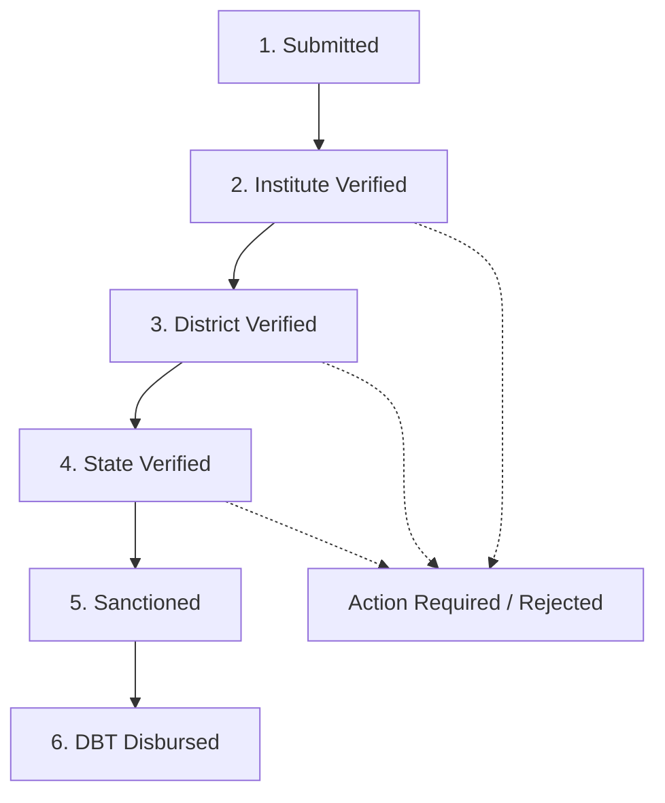

# 🏹 EkChhatra (एक छात्र) — Unified ST Scholarship Portal

<div align="center">

[](https://client-omega-rouge-20.vercel.app)
[](https://ekchhatra-backend.onrender.com)
[](https://ekchhatra-backend.onrender.com/docs)
[](https://client-omega-rouge-20.vercel.app)

### 🌐 **Live Web App**: [https://client-omega-rouge-20.vercel.app](https://client-omega-rouge-20.vercel.app)
*Compatible with every device — Android, iOS, Tablet, Laptop, and Desktop. Includes 1-Click Demo Login.*

</div>

---

## 🚀 Live Production Deployment

| Component | Cloud Platform | Live Public Endpoint |
|---|---|---|
| 📱 **Frontend Web App** | **Vercel** | **[https://client-omega-rouge-20.vercel.app](https://client-omega-rouge-20.vercel.app)** |
| ⚙️ **Backend API Gateway** | **Render** | **[https://ekchhatra-backend.onrender.com](https://ekchhatra-backend.onrender.com)** |
| 📖 **Interactive API Documentation** | **Render Swagger** | **[https://ekchhatra-backend.onrender.com/docs](https://ekchhatra-backend.onrender.com/docs)** |
| 🐙 **GitHub Repository** | **GitHub** | **[https://github.com/yusufsheikh2716/EkChhatra-ST-Portal](https://github.com/yusufsheikh2716/EkChhatra-ST-Portal)** |

---

## 🌟 Executive Summary

**EkChhatra** is a unified digital scholarship gateway built specifically for Scheduled Tribe (ST) students across India. It integrates 5 premier Ministry of Tribal Affairs (MoTA) and central schemes into a single dashboard:
1. **Pre-Matric Scholarship for ST Students (Class 9 & 10)**
2. **Post-Matric Scholarship for ST Students (Class 11 to PG)**
3. **Top Class Education Scheme for ST Students (IITs, IIMs, NITs, AIIMS, NLUs)**
4. **National Fellowship for Higher Education of ST Students (NFST - Ph.D./M.Phil)**
5. **National Overseas Scholarship for ST Students (NOS - Foreign Masters & Ph.D.)**

Powered by real-time WebGL shader visuals (`GhostFibers`), canvas typography (`ParticleText`), simulated instant DigiLocker/UIDAI verification, an automated multi-scheme eligibility engine, and the **JAGO** AI scholarship guide.

---

## 🛡️ Key Security & Architecture Fixes Applied

1. **Environment-Driven JWT Secret**: No hardcoded secrets. Loaded securely via `pydantic-settings` from `.env` with a secure random fallback generation and `.env.example` provided.
2. **Production-Ready CORS Scoping**: Backend CORS is configured for development (`http://localhost:5173`, `http://localhost:3000`) and customizable via `CORS_ORIGINS` in `.env`.
3. **Aadhaar Privacy Preservation**: Full 12-digit Aadhaar numbers are **never stored** in the database. Only the masked last 4 digits (`XXXX-XXXX-1234`) are persisted for student identification and DBT mapping.
4. **Zero External API Guarantee (Phase 1)**: All eligibility checks, conflict detection, JAGO NLP assistant queries, and verifications function 100% locally with zero required paid API keys.
5. **Phase 2 Resilient Fallbacks**:
   - **AI Document OCR Scanner**: Uses `pytesseract` + Pillow with an automated fallback so missing host binaries never interrupt demos.
   - **Multilingual Voice Chatbot**: Uses the browser's native Web Speech API (`SpeechRecognition` / `speechSynthesis`) for Hindi/English with full text fallback.
   - **Offline-First PWA**: Web App Manifest and offline readiness configured.

---

## 🚀 Quick Start Guide

### Prerequisites
- Python 3.11+
- Node.js 18+ / npm

### 1. Backend Setup & Run (FastAPI + SQLite)
```bash
cd server

# Create and activate virtual environment
python3 -m venv venv
source venv/bin/activate  # On Windows: venv\Scripts\activate

# Install requirements
pip install -r requirements.txt

# Run server (Database auto-seeds on first startup)
uvicorn main:app --reload --port 8000
```
- API Base: `http://localhost:8000`
- Interactive Swagger Docs: `http://localhost:8000/docs`

### 2. Frontend Setup & Run (React 18 + Vite + Tailwind)
```bash
cd client

# Install dependencies
npm install

# Start development server
npm run dev
```
- Open browser: `http://localhost:5173`

---

## 🔑 Demo Credentials (Immediate 1-Click Access)

| Role | Email | Password | Pre-seeded Features |
| :--- | :--- | :--- | :--- |
| **ST Student (Birsa Munda)** | `demo@ekchhatra.in` | `demo123` | NIT Jamshedpur student, active Top Class application at *State_Verified* stage, previous disbursed Post-Matric application (₹38,500), 5 verified DigiLocker documents |
| **MoTA Officer / Admin** | `admin@ekchhatra.in` | `admin123` | Ministry Directorate view |

> 💡 *Tip: On the Login page, click the **"Use Demo Account (Birsa Munda)"** button for instant 1-click login.*

---

## 🏛️ Verified Official Government Gateways

All schemes provide direct redirection to official portals (`target="_blank" rel="noopener noreferrer"`):
- **Ministry of Tribal Affairs (MoTA)**: [tribal.nic.in](https://tribal.nic.in/)
- **National Scholarship Portal (NSP)**: [scholarships.gov.in](https://scholarships.gov.in/)
- **NFST Fellowship (Canara Bank SFMP)**: [nfrsfmp.canarabank.in](https://nfrsfmp.canarabank.in/)
- **National Overseas Portal (NOS)**: [nosmsje.gov.in](https://nosmsje.gov.in/)
- **DigiLocker National Gateway**: [digilocker.gov.in](https://www.digilocker.gov.in/)
- **UIDAI Aadhaar Seeding**: [uidai.gov.in](https://uidai.gov.in/)
- **Academic Bank of Credits (APAAR)**: [abc.gov.in](https://www.abc.gov.in/)
- **UDISE+ School Registry**: [udiseplus.gov.in](https://udiseplus.gov.in/)
- **AISHE Higher Education**: [aishe.gov.in](https://aishe.gov.in/)
- **University Grants Commission (UGC)**: [ugc.gov.in](https://www.ugc.gov.in/)

---

## 🎨 Tech Stack & Libraries

### Frontend
- **Framework**: React 18 + Vite
- **Styling**: TailwindCSS 3 (Deep Purple `#1a1a2e`, Tribal Crimson `#e94560`, Gold `#f5a623`, Deep Teal `#0f3460`, Emerald `#10b981`)
- **WebGL Background**: `ogl` (GhostFibers shader component)
- **Interactive Typography**: `ParticleText` canvas particle physics
- **Animations & Transitions**: `framer-motion` (Route transitions & spring physics)
- **Charts & Data**: `recharts` (Donut, Area trend, and Bar charts)
- **Icons & Notifications**: `lucide-react`, `react-hot-toast`, `canvas-confetti`

### Backend
- **Framework**: FastAPI (Python 3.11+) + Uvicorn
- **Database**: SQLAlchemy 2.0 Async + SQLite (`aiosqlite`)
- **Authentication**: JWT (`python-jose[cryptography]`) + Bcrypt (`passlib[bcrypt]`)
- **Configuration**: `pydantic-settings` + `python-dotenv`
- **OCR Engine**: `pytesseract` + Pillow (with fallback)
- **Simulated Verifications**: UIDAI e-KYC, DigiLocker ST Registry, State e-District Income, and AISHE/NAD Academic checks

---

## 📊 Application Verification Workflow (7 Stages)



| Stage | Verification Authority | Objective |
| :--- | :--- | :--- |
| **1. Submitted** | Student (e-Sign) | Application registered with verified Aadhaar e-KYC |
| **2. Institute Verified** | School / College Nodal Officer | Enrolment, fee structure, bonafide & marksheet checked |
| **3. District Verified** | District Welfare Officer (DWO) | ST Caste Certificate verified against State Tribal Registry |
| **4. State Verified** | State Directorate of Tribal Welfare | State quota & income eligibility scrutiny |
| **5. Sanctioned** | Ministry of Tribal Affairs (MoTA) | Central financial sanction order generated |
| **6. DBT Disbursed** | PFMS / NPCI Aadhaar Bridge | Direct scholarship amount credited into seeded bank account |

---

## 📢 Hackathon Prototype Disclaimer
*Digital verification responses from UIDAI e-KYC, DigiLocker, and State Tribal registries are realistically simulated within the prototype backend for end-to-end evaluation without relying on restricted government API credentials.*
